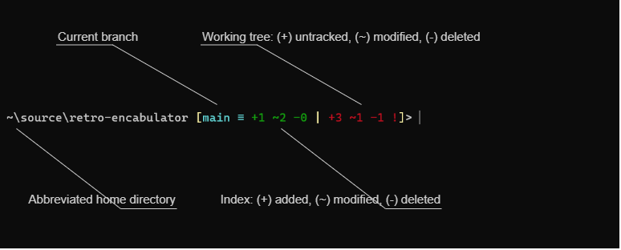

# panache-git

An opinionated Git prompt for Nushell, styled after posh-git

## What is this?

panache-git is a shell prompt for [Nushell](https://www.nushell.sh/) that briefly summarizes the current status of your [Git](https://git-scm.com/) repository.
It seeks to emulate the default prompt design of [posh-git](https://github.com/dahlbyk/posh-git), an excellent Git prompt and completion engine for PowerShell.



If you're wondering what all of those symbols and colors mean, the posh-git documentation has [a full breakdown](https://github.com/dahlbyk/posh-git#git-status-summary-information).

## How do I install it?

Before you can use panache-git, you will need:

- [Git](https://git-scm.com/)
- [Nushell](https://www.nushell.sh/)

To install panache-git:

1. Read over the [panache-git.nu](./panache-git.nu) script - if it's going to run on your system, a little extra caution can't hurt

2. Download the script

   ```nu
   git clone https://github.com/ehdevries/panache-git.git ~/.panache-git
   ```

3. Open your Nushell environment config file with your favorite editor

   ```nu
   code $nu.env-path  # for example, with VS Code
   ```

4. In the config file:

   - Source the `panache-git.nu` script
   - Set `panache-git` as your prompt command
   - Disable the separate prompt indicator by setting it to an empty string

   ```nu
   source ~/.panache-git/panache-git.nu
   let-env PROMPT_COMMAND = { panache-git }
   let-env PROMPT_INDICATOR = { "" }
   ```

5. Restart Nushell

## How is this different from posh-git?

| posh-git | panache-git |
| --- | --- |
| Informative and attractive Git prompt | Informative and attractive Git prompt |
| Only works with PowerShell | Only works with Nushell |
| Cross-platform (with PowerShell Core 6+) | Cross-platform |
| Highly configurable | Opinionated (the nice way of saying "not configurable") |
| Tab-completion for Git commands and branch names | No completions, although Nushell itself has built-in support for [custom completions](https://www.nushell.sh/book/custom_completions.html) and includes a few Git completions in its [default config file](https://www.nushell.sh/book/configuration.html) |

## Why?

Nushell is a delightful and exciting new kind of shell.
posh-git is a fantastic Git prompt, but it's exclusive to PowerShell.
panache-git is for posh-git fans who want to dive into Nushell but don't want to leave behind the Git prompt they know.

### ... and the name?

Imagine starting with "posh-git" and squeezing "nu" into the middle of the first word - you'd get something like "po-nu-sh-git".
Now say that out loud a few times.
Pretty soon, it starts to sound like "panache-git".

Also, "panache" is a fun word with [an amusing history](https://www.merriam-webster.com/dictionary/panache).

Give a dash of style to your shell prompt.

## It's not working :-(

If you encounter a problem with panache-git, the first step is to make sure you've installed the latest version of Nushell.
Nushell is pre-release software and may introduce breaking changes at any time.

If you continue to encounter the problem after updating, please open an issue - finding bugs is much appreciated!

## Thank you

panache-git owes a debt of gratitude to a number of wonderful open-source projects - in particular:

- [Git](https://github.com/git/git)
- [Nushell](https://github.com/nushell/nushell)
- [posh-git](https://github.com/dahlbyk/posh-git)

If you like this project, consider giving those other projects some love.
